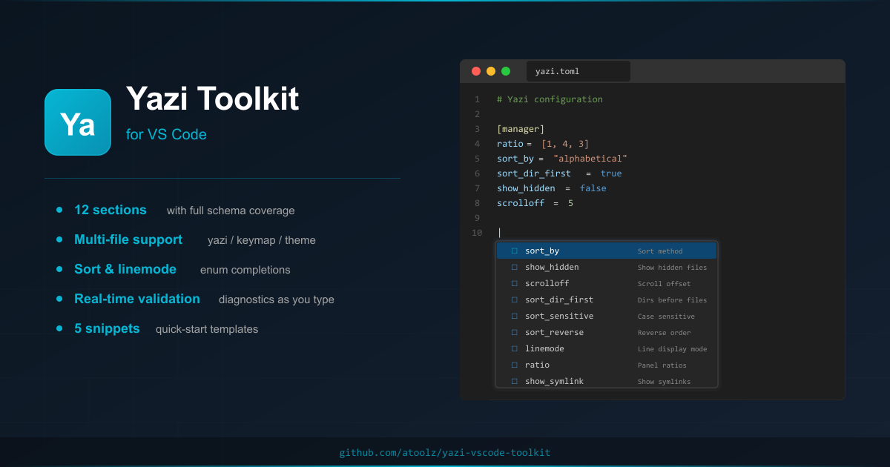
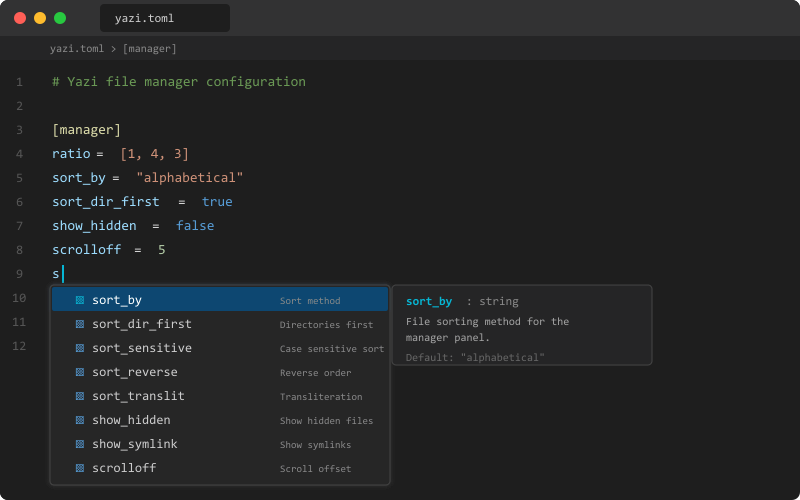
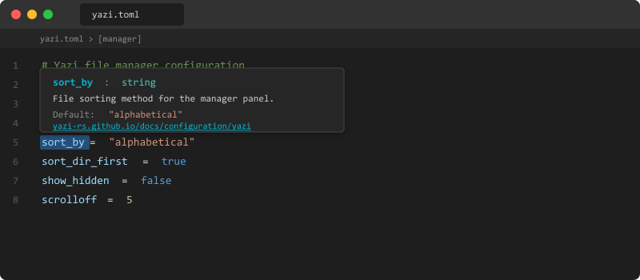
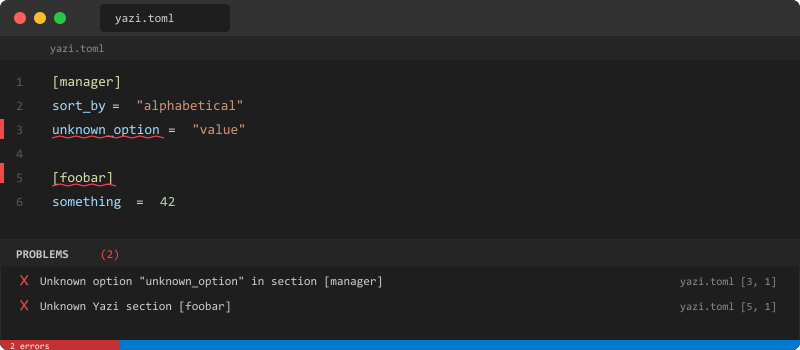

<p align="center">
  
</p>

<h1 align="center">Yazi Toolkit</h1>

<p align="center">
  <strong>Complete IntelliSense, validation, and documentation for <code>yazi.toml</code>, <code>keymap.toml</code>, and <code>theme.toml</code> configuration</strong>
</p>

<p align="center">
  <a href="https://marketplace.visualstudio.com/items?itemName=atoolz.yazi-vscode-toolkit">
    
  </a>
  <a href="https://marketplace.visualstudio.com/items?itemName=atoolz.yazi-vscode-toolkit">
    
  </a>
  <a href="https://marketplace.visualstudio.com/items?itemName=atoolz.yazi-vscode-toolkit">
    
  </a>
  <a href="https://github.com/atoolz/yazi-vscode-toolkit/blob/main/LICENSE">
    
  </a>
  <a href="https://yazi-rs.github.io">
    
  </a>
</p>

---

[Yazi](https://yazi-rs.github.io) is a blazing-fast terminal file manager written in Rust. This extension brings first-class editing support for its configuration files (`yazi.toml`, `keymap.toml`, and `theme.toml`) directly into VS Code.

## Features

### IntelliSense Completions

Full autocompletion for all Yazi sections, their options, enum values, and boolean fields.

- **Section headers** - Autocomplete `[section_name]` with all known sections
- **Option keys** - Context-aware completion with types and defaults per section
- **Enum values** - Smart completions for `sort_by` (alphabetical, created, modified, natural, size, random) and `linemode` values
- **Booleans** - `true` / `false` suggestions for boolean options

<p align="center">
  
</p>

### Hover Documentation

Hover over any section name or option to see its description, type, default value, and a direct link to the Yazi documentation.

<p align="center">
  
</p>

### Diagnostics and Validation

Real-time validation catches configuration errors as you type:

- Unknown configuration sections
- Unknown options within sections
- Type mismatches (string where boolean expected, etc.)

<p align="center">
  
</p>

### Snippets

Quick-start templates for common configurations:

| Prefix | Description |
|---|---|
| `yazi-starter` | A complete Yazi starter configuration with common settings |
| `yazi-opener` | Custom file opener definition |
| `yazi-plugin` | Plugin configuration with custom previewers and preloaders |
| `yazi-sort` | Sort configuration for the file manager |
| `yazi-preview` | Preview pane settings with dimensions and Ueberzug options |

## Supported Sections

All official Yazi configuration sections are supported with full option definitions:

`manager` `preview` `opener` `open` `tasks` `plugin` `input` `confirm` `select` `which` `log`

## Installation

1. Open VS Code
2. Go to Extensions (`Ctrl+Shift+X` / `Cmd+Shift+X`)
3. Search for **Yazi Toolkit**
4. Click **Install**

Or install from the command line:

```bash
code --install-extension atoolz.yazi-vscode-toolkit
```

## Requirements

- VS Code 1.85.0 or higher
- A TOML language extension (e.g., [Even Better TOML](https://marketplace.visualstudio.com/items?itemName=tamasfe.even-better-toml)) for syntax highlighting

The extension activates automatically when you open a file named `yazi.toml`, `keymap.toml`, or `theme.toml`.

## Contributing

Contributions are welcome. Please open an issue or pull request on [GitHub](https://github.com/atoolz/yazi-vscode-toolkit).

## License

[MIT](LICENSE)
